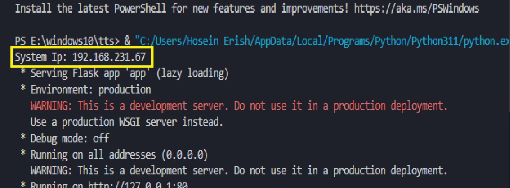
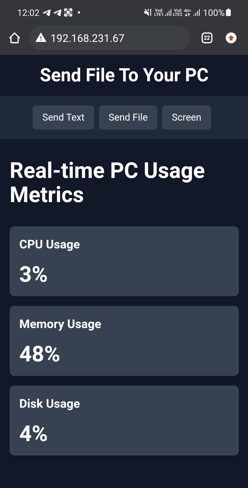
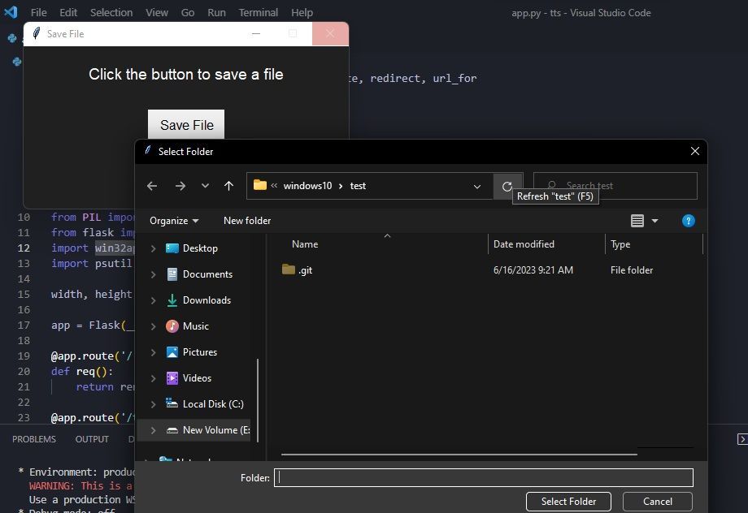
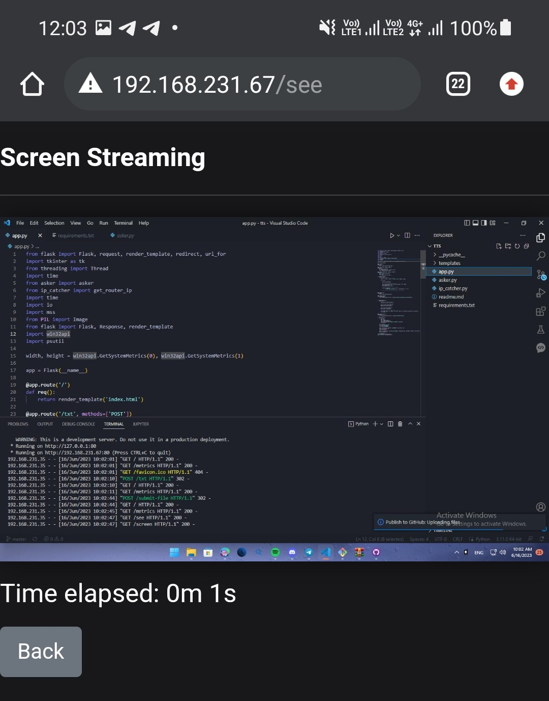

PCMNG
=====

PCMNG is a tool that allows you to connect to devices in a router and send text, files, and view the device's screen. It can be used on Windows and other operating systems.

Installation
------------

To install PCMNG, follow these steps:

1.  Download the latest release of PCMNG from the [GitHub repository](https://github.com/erillia/pcmng).
2.  Extract the downloaded archive to a folder on your computer.
3.  Run `app.py` to start the tool.

Connection
--------
*   You can connect to a wifi with both devices
*   You can USB tether with your phone
*   If you are using VPN on phone or device that you want to contact to pc , add 192.168.\*.\* ip range to direct request and white lists

Usage
-----

PCMNG can be used to connect to devices in a router and perform the following actions:

*   Send text messages to the device.
*   Send files to the device.
*   View the device's screen.

To use PCMNG, follow these steps:

1.  Connect your computer to the router or enable USB tethering on your device.
2.  Run `app.py`.
3.  Select the device you want to connect to from the list of available devices.
4.  Choose the action you want to perform (send text, send file, or view screen).
5.  Follow the prompts to complete the action.

6.   open the url in any device on router that shown in terminal

7.  you see the main page

Sending text to pc
----------------
1.   Click on Send Text button
2.   Write what you want
3.   Submit
4.   A popup will be shown ,Copy the text on pc

Sending file to pc
--------
1.  Click on send File
2.  Select file
3.  A popup for selecting file save location will be shown, select the path and after showing alert (saving sucessful!) close it.

Stream pc screen
------
1. Click on Screen
2. enjoy

Development
-----------

If you want to contribute to PCMNG, follow these steps:

1.  Clone the GitHub repository: `git clone https://github.com/erillia/pcmng.git`
2.  Install the required dependencies: `npm install`
3.  Make your changes to the code.
4.  Test your changes: `npm test`
5.  Submit a pull request to the repository.

License
-------

PCMNG is licensed under the MIT License. See the `LICENSE` file for more information.

Credits
-------

PCMNG was created by [Hosein Erish](https://github.com/erillia).

I support idea
-------
If you have any idea contact me!